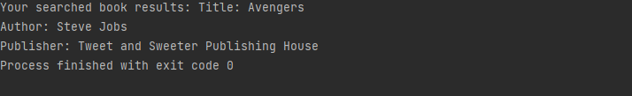

# BookShelf
## Introduction
Bookshelf is a learning repo where you build a console app that models after a bookshelf. 
Bookshelf can sort any books created by Author, Title, or Copyright year.

## Images

